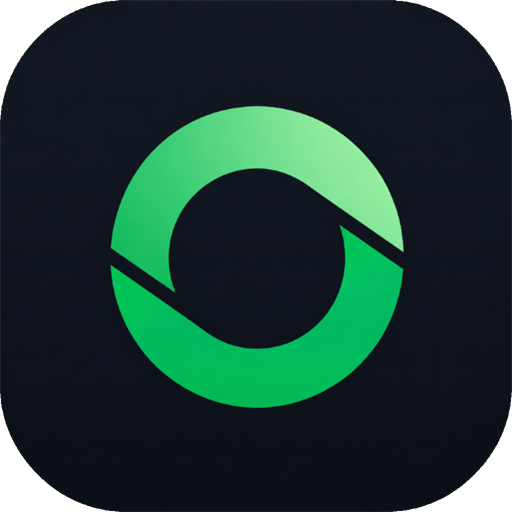

<p align="center">
  
</p>

<h1 align="center">Ocal Screen</h1>

<p align="center">
  <strong>The Ultimate Studio-Grade Screen Recorder & Video Editor</strong><br />
  Record your screen, auto-focus key moments with AI zoom, add animated captions, and export studio-quality videos — all locally with total privacy.
</p>

<p align="center">
  <a href="https://github.com/neelkanth-patel26/Ocal-Screen/blob/main/LICENSE">
    
  </a>
  
  
  <a href="https://gamingnetworkstudio.vercel.app">
    
  </a>
</p>

<p align="center">
  
</p>

---

## 🌟 Welcome to Ocal Screen

**Ocal Screen** is a powerful, free, and open-source screen recording and video editing app designed for creators, educators, software developers, and professionals. Whether you are recording product demos, video tutorials, bug reports, or gaming highlights, Ocal Screen turns raw screen captures into polished, studio-ready videos in minutes.

Unlike cloud-based recorders, **Ocal Screen runs 100% locally on your computer**. Your videos, voice recordings, and screen telemetry never leave your device.

---

## ✨ Feature Highlights

### 🎯 Smart AI Auto-Zoom
- Automatically detects mouse clicks and live text typing sessions to focus the camera right where the action happens.
- Continuous action clustering keeps your video zoomed in smoothly while you type or interact, preventing abrupt camera jumpiness.
- Custom zoom depth, position, duration, and smooth motion blur controls on the interactive timeline.

### 🖱️ Animated Custom Cursors
- Replaces plain operating system mouse pointers with sleek, customizable cursor styles.
- Adjust cursor size, smoothing, motion blur, and click ripple animation effects to make tutorial steps crystal clear.

### 🎙️ Offline AI Captions & Audio
- Generate automatic captions for your voiceover directly on your computer without sending audio to the cloud.
- Support for system audio recording and microphone input with live audio level indicators.

### 📹 Picture-in-Picture Webcam
- Overlay your webcam with customizable shapes (circle, rounded square, rectangle), sizes, and drag-and-drop positioning.
- Enable camera mirroring and smooth camera framing.

### 🖼️ Beautiful Backgrounds & Canvas Framing
- Surround your video with vibrant wallpapers, solid colors, custom image backdrops, or subtle glassmorphism blurs.
- Add rounded video corners, drop shadows, and custom canvas aspect ratios (16:9, 9:16 vertical, 1:1 square, 4:3).

### 🎨 Personal Studio Themes & Accents
- Choose your favorite studio theme (**Dark Mode** or **Light Mode**).
- Personalize your studio interface with custom accent color palettes (Neon Lime, Electric Cyan, Sunset Orange, Emerald Green, Royal Purple, or Hot Pink).

### 🎬 Professional Timeline Editor
- Trim unwanted video segments, crop video bounds, adjust playback speeds, and split clips easily.
- Add animated text, arrows, icons, and image annotations to highlight key screen elements.
- Export crisp videos in **MP4** or animated **GIF** formats.

---

## 📥 How to Install Ocal Screen

Installing Ocal Screen takes less than a minute. Choose your operating system below:

### 🪟 Windows
1. Download the latest installer (`OcalScreen-Setup.exe`) from the [Official Releases](https://github.com/neelkanth-patel26/Ocal-Screen/releases).
2. Double-click the installer and follow the quick setup wizard.
3. Open **Ocal Screen** from your Start Menu or Desktop shortcut.

---

### 🍎 macOS
1. Download the `.dmg` package from [Official Releases](https://github.com/neelkanth-patel26/Ocal-Screen/releases).
2. Drag **Ocal Screen** into your **Applications** folder.
3. Open **System Settings → Privacy & Security** and grant permissions for **Screen Recording** and **Accessibility**.
4. *(Optional)* If macOS displays a security warning, open Terminal and run:
   ```bash
   xattr -rd com.apple.quarantine /Applications/OcalScreen.app
   ```

---

### 🐧 Linux
Download your preferred distribution package from [Official Releases](https://github.com/neelkanth-patel26/Ocal-Screen/releases):

- **Ubuntu / Debian (`.deb`)**:
  ```bash
  sudo apt install ./OcalScreen-Linux-latest.deb
  ```
- **Arch Linux / Manjaro (`.pacman`)**:
  ```bash
  sudo pacman -U OcalScreen-Linux-latest.pacman
  ```
- **AppImage (Universal)**:
  ```bash
  chmod +x OcalScreen-Linux-*.AppImage
  ./OcalScreen-Linux-*.AppImage
  ```

---

## 🚀 Quick Start Guide

1. **Launch the Recorder**: Open Ocal Screen to display the floating launcher bar.
2. **Select Screen & Audio**: Choose your screen, window, microphone, or webcam source.
3. **Record Your Video**: Click **Record** or press your shortcut key (`Ctrl+Shift+R` / `Cmd+Shift+R`).
4. **Edit & Polish**: Once stopped, your video opens immediately in the Ocal Screen Studio Editor. Adjust AI zooms, add captions, customize backgrounds, or trim clips.
5. **Export & Share**: Click **Export** to save your video as an MP4 or GIF to share with the world!

---

## 🌐 Supported Languages

Ocal Screen speaks your language! Available in 13+ languages:
- English, Spanish, French, Italian, German, Portuguese (Brazil)
- Japanese, Korean, Simplified Chinese, Traditional Chinese
- Arabic, Russian, Turkish, Vietnamese

---

## 🏢 Maintained & Supported By

<p align="center">
  <strong>Ocal Software</strong><br />
  <em>by Gaming Network Studio Media Group</em><br />
  <a href="https://gamingnetworkstudio.vercel.app">🌐 gamingnetworkstudio.vercel.app</a>
</p>

---

## 📄 License

Ocal Screen is open-source software licensed under the [MIT License](./LICENSE). Free for personal, educational, and commercial use.
